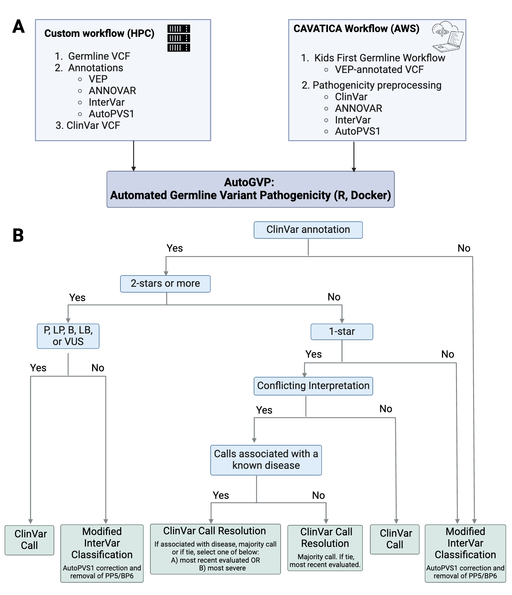

# AutoGVP: Automated Germline Variant Pathogenicity
Jung Kim, Ammar S. Naqvi, Rebecca Kaufman, Miguel A. Brown, Ryan J. Corbett, Zhuangzhuang Geng, Zalman Vaksman, Phillip B. Storm, Adam C. Resnick, Jo Lynne Rokita, Douglas R. Stewart, Sharon J. Diskin

## AutoGVP Workflow  


## Step by step workflow (_-w cavatica workflow_)
- Read in user inputted clinVar file
- Create `vcf_id` (chr and position)
- Annotate stars based on `CLNREVSTAT`*
- Report and save significant call if Stars are not 0 or 1 and not B/P/LB/LP/VUS
- Identify variants that are ambiguous (“criteria_provided,_conflicting_interpretations’), generate table to then check against submission file
- Identify variants that need further annotations or possible re-adjustment (Stars 0 or 1)
- Retrieve and store interVar results file into table and create vcf_id
- Retrieve and store corresponding autopvs1 results file into table and create vcf_id
- Merge interVar and autopvs1 tables by matching vcf_ids
- Create columns for `evidencePVS1`, `evidencePS`, `evidencePM`, `evidencePP`, `evidenceBP`, `evidencePM` and `evidenceBA1` (variables that may need re-adjusting) by parsing InterVar: InterVar and Evidence column
- Indicate if there needs to be recalculation (if `evidencePVS1` == 1)
- If not, take interVar significant call as final_call
- Go through entries and adjust evidence variables above based on criterion*
- Report final call based on recalculated evidence variables

## Docker set-up

### docker pull and run
```bash
docker pull pgc-images.sbgenomics.com/naqvia/germline-pathogenicity-assessment:latest
docker run --platform linux/amd64 --name pathogenecity_anno -d -v $PWD:/home/rstudio/pathogenecity-assessment pgc-images.sbgenomics.com/naqvia/germline-pathogenicity-assessment:latest

```
### docker execute
```bash
docker exec -ti pathogenecity_anno bash
```

### cd to AutoGVP directory
```bash
cd /home/rstudio/AutoGVP
```

## How to Run

### CAVATICA input ###
1. Run the [Kids First Germline Annotation Workflow](https://github.com/kids-first/kf-germline-workflow/blob/v0.4.4/docs/GERMLINE_SNV_ANNOT_README.md) first.
This workflow currently annotates variants with ClinVar (2022-05-07).
2. Run the [Pathogenicity Preprocessing Workflow](https://github.com/d3b-center/D3b-Pathogenicity-Preprocessing), which performs ANNOVAR with InterVar and AutoPVS1 annotations.
3. Run AutoGVP.

AutoGVP Requirements (recommended to place all in the `input/` folder):
- VEP-, ANNOVAR-, and ClinVar annotated VCF file (`*VEP.vcf`)
- ANNOVAR multianno file (`*hg38_multianno.txt`)
- InterVar file (`*intervar.hg38_multianno.txt.intervar`)
- AutoPVS1 file (`*autopvs1.txt`)
- `variant_summary.txt`
- `submission_summary.txt.gz` (can retrieve with `download_db_files.sh`)
Note: the variant_summary and submission_summary files need to be uncompressed.

Example run:

```bash
bash download_db_files.sh
```
```r
Rscript 01-annotate_variants_custom_input.R --vcf <*.vcf> --multianno <*multianno.txt> --intervar <*hg38_multianno.txt.intervar> --autopvs1 <*autopvs1.txt --output <output_prefex> --submission input/variant_summary.txt --submission_summary input/submission_summary.txt
```

### Custom (non-CAVATICA) input ###
1. Annotate the germline VCF with VEP.
2. Run ANNOVAR with InterVar with the following options (to create the VCF input for AutoGVP).
```perl
perl table_annovar.pl input/test_hg38_selected_VEP_annotated.vcf hg38 --buildver hg38 --out test_hg38_selected --remove --protocol gnomad211_exome,gnomad211_genome --operation f,f --vcfinput
```
3. Run AutoPVS1.
4. Optional: VCF annotation with ClinVar. If not done by the user, ClinVar file is required input to AutoGVP.
4. Run AutoGVP.

AutoGVP Requirements (recommended to place all in the `input/` folder):
- VEP- and ANNOVAR-annotated VCF (`*VEP.vcf`)
- ANNOVAR file (`*hg38_multianno.txt`)
- InterVar file (`*intervar.hg38_multianno.txt.intervar`)
- AutoPVS1 file (`*autopvs1.txt`)
- ClinVar VCF (`clinvar_yyyymmdd.vcf.gz`; optional)
- `variant_summary.txt`
- `submission_summary.txt.gz` (can retrieve with `download_db_files.sh`)
Note: the variant_summary and submission_summary files need to be uncompressed.

Example run:
```bash
bash download_db_files.sh
```
```r
Rscript 01-annotate_variants_custom_input.R --vcf input/testing_010423_VEP.vcf --multianno input/testing_010423.hg38_multianno.txt --intervar input/testing_010423_intervar.hg38_multianno.txt.intervar --autopvs1 input/testing_010423_autopvs1.txt --clinvar input/clinvar_20211225.vcf.gz --output SRRT0182 --submission input/variant_summary.txt --submission_summary input/submission_summary.txt
```

#### Annotating Stars
```
1 = 'criteria_provided,_single_submitter'
2 = 'criteria_provided,_multiple_submitters'
3 = 'reviewed_by_expert_panel'
4 = 'practice_guideline'
0/Need resolving = 'criteria_provided,_conflicting_interpretations'
```

#### Re-calculation adjustments
```
if criterion is NF1|SS1|DEL1|DEL2|DUP1|IC1 then PVS1=1
if criterion is NF3|NF5|SS3|SS5|SS8|SS10|DEL8|DEL6|DEL10|DUP3|IC2 then PVS1 = 0; PS = PS+1
if criterion is NF6|SS6|SS9|DEL7|DEL11|IC3 then PVS1 = 0; PM = PM+1;
if criterion is NF6|SS6|DEL7|DEL11|IC3 then PVS1 = 0; PP = PP+1;
if criterion is IC4 then PVS1 = 0; PP = PP+1;
if criterion is na|NF0  then PVS1 = 0;

New ClinSig
Pathogenic - Criteria 1
  (i) 1 Very strong (PVS1) AND
        (a) ≥1 Strong (PS1–PS4) OR
        (b) ≥2 Moderate (PM1–PM6) OR
        (c) 1 Moderate (PM1–PM6) and 1 supporting (PP1–PP5) OR
        (d) ≥2 Supporting (PP1–PP5)

Pathogenic - Criteria 2
  (ii) ≥2 Strong (PS1–PS4) OR

Pathogenic - Criteria 3
  (iii) 1 Strong (PS1–PS4) AND
        (a)≥3 Moderate (PM1–PM6) OR
        (b)2 Moderate (PM1–PM6) AND ≥2 Supporting (PP1–PP5) OR
        (c)1 Moderate (PM1–PM6) AND ≥4 supporting (PP1–PP5)

Likely pathogenic
        (i) 1 Very strong (PVS1) AND 1 moderate (PM1– PM6) OR
        (ii) 1 Strong (PS1–PS4) AND 1–2 moderate (PM1–PM6) OR
        (iii) 1 Strong (PS1–PS4) AND ≥2 supporting (PP1–PP5) OR
        (iv)  ≥3 Moderate (PM1–PM6) OR
        (v) 2 Moderate (PM1–PM6) AND ≥2 supporting (PP1–PP5) OR
        (vi) 1 Moderate (PM1–PM6) AND ≥4 supporting (PP1–PP5)

Benign
        (i) 1 Stand-alone (BA1) OR
        (ii) ≥2 Strong (BS1–BS4)

Benign
        (i) 1 Stand-alone (BA1) OR
        (ii) ≥2 Strong (BS1–BS4)

Likely Benign
        (i) 1 Strong (BS1–BS4) and 1 supporting (BP1– BP7) OR
        (ii) ≥2 Supporting (BP1–BP7)

Uncertain  significance
        (i) non of the criteria were met.
        (ii) Benign and pathogenic are contradictory.
```

## Code Author

Ammar S. Naqvi ([@naqvia](https://github.com/naqvia))

## Contact

For questions, please submit an issue or send an email to Jo Lynne Rokita ([@jharenza](https://github.com/jharenza)): rokita@chop.edu
