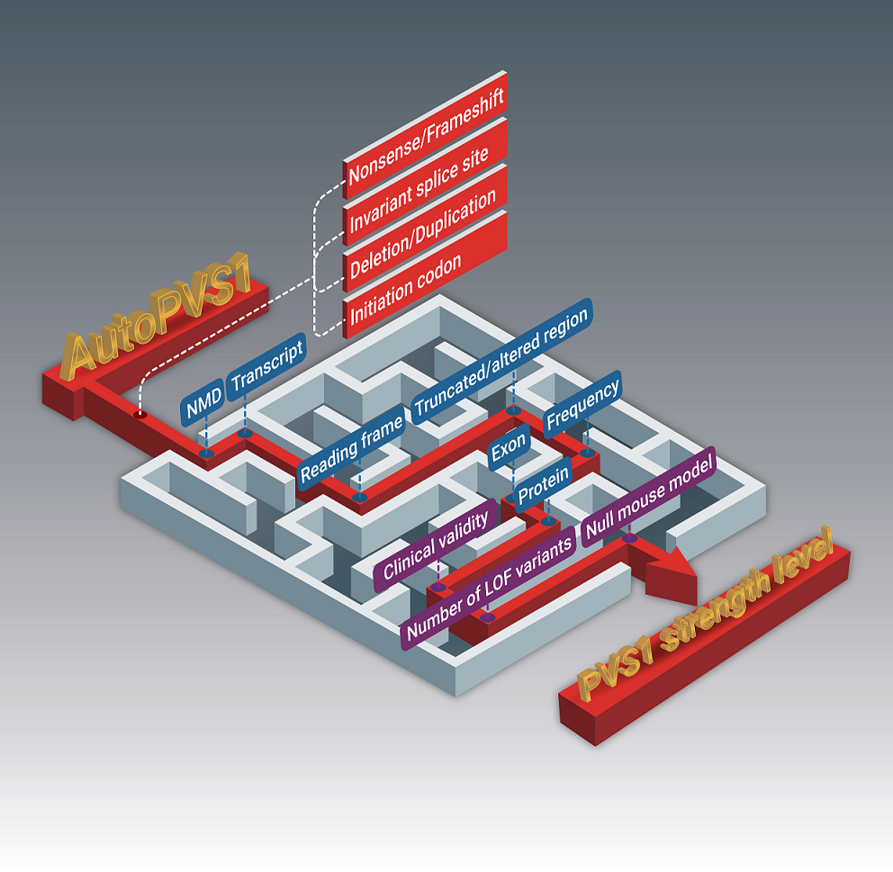
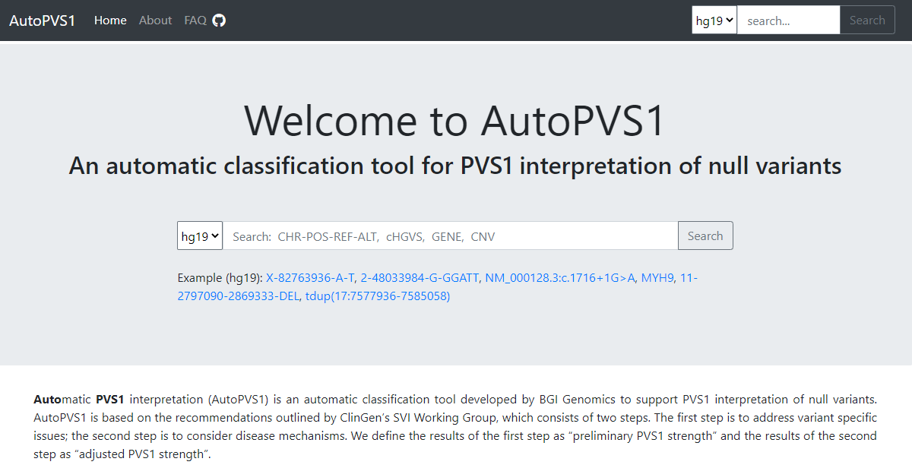

# AutoPVS1
An automatic classification tool for PVS1 interpretation of null variants.
This is a modifed port of the original https://github.com/JiguangPeng/autopvs1, branched from commit `7fb1be97667e5ef576f81bf2fabbddcf9a4c7594`.
Major modifications include:
 - Gutting running of VEP, as it is assumed it was run ahead of time
 - Gutting CNV functions as they are not currently used
 - Parsing of an already VEP-annotated vcf file using pysam
 - Config file should be at `pwd`, data files in config best with full paths
 - Dropped hg19 references and made imports absolute instead of relative
We have noted in some sections where things stayed the same and other changed



A web version for AutoPVS1 is also provided: http://autopvs1.genetics.bgi.com



## PREREQUISITE
### 1. Variant Effect Predictor (VEP)
VEP should have been run ahead of time, no longer built-in.
Recommend KFDRC Germline Annotation Workflow: [CWL source code](https://github.com/kids-first/kf-germline-workflow/blob/v0.4.2/workflows/kfdrc-germline-snv-annot-workflow.cwl) can be run on Cavatica or with any cwl runner.

### 2. pyfaidx (original author recommendation)
Samtools provides a function “faidx” (FAsta InDeX), which creates a small flat index file “.fai” 
allowing for fast random access to any subsequence in the indexed FASTA file, 
while loading a minimal amount of the file in to memory. 

[pyfaidx](https://pypi.org/project/pyfaidx/) module implements pure Python classes for indexing, retrieval, 
and in-place modification of FASTA files using a samtools compatible index.

### 3. maxentpy (original author recommendation)
[maxentpy](https://github.com/kepbod/maxentpy) is a python wrapper for MaxEntScan to calculate splice site strength.
It contains two functions. score5 is adapt from [MaxEntScan::score5ss](http://hollywood.mit.edu/burgelab/maxent/Xmaxentscan_scoreseq.html) to score 5' splice sites. score3 is adapt from [MaxEntScan::score3ss](http://hollywood.mit.edu/burgelab/maxent/Xmaxentscan_scoreseq_acc.html) to score 3' splice sites. 

maxentpy is already included in the **autopvs1**.

### 4. pyhgvs (original author recommendation)
[pyhgvs](https://github.com/counsyl/hgvs) provides a simple Python API for parsing, formatting, and normalizing HGVS names.
But it only supports python2, I modified it to support python3 and added some other features. 
It is also included in the **autopvs1**.

### 5. Configuration

`pwd/config.ini`

```ini
[DEFAULT]
pvs1levels = data/PVS1.level
gene_alias = data/hgnc.symbol.previous.tsv
gene_trans = data/clinvar_trans_stats.tsv

[HG38]
genome = data/hg38.fa
transcript = data/ncbiRefSeq_hg38.gpe
domain = data/functional_domains_hg38.bed
hotspot = data/mutational_hotspots_hg38.bed
curated_region = data/expert_curated_domains_hg38.bed
exon_lof_popmax = data/exon_lof_popmax_hg38.bed
pathogenic_site = data/clinvar_pathogenic_GRCh38.vcf
```

All refs obtained from original git repo from `data` dir except for hg38 fasta.
User should provide that as part of input

**Note:** the chromesome name in fasta files should have `chr` prefix

## USAGE

```sh
python3 pathogenicity-assessment/autopvs1/autoPVS1_from_VEP_vcf.py hg38 ~/volume/VEP_TEST/AUTOPVS1_TEST/input_VEP_annotated.vcf.gz > output.autopvs1.tsv
```

## FAQ
Please see https://autopvs1.genetics.bgi.com/faq/

## TERM OF USE
Users may freely use the AutoPVS1 for non-commercial purposes as long as they properly cite it. 

This resource is intended for research purposes only. For clinical or medical use, please consult professionals.

:memo:**citation:** *Jiale Xiang, Jiguang Peng, Samantha Baxter, Zhiyu Peng. (2020). [AutoPVS1: An automatic classification tool for PVS1 interpretation of null variants](https://onlinelibrary.wiley.com/doi/epdf/10.1002/humu.24051). Hum Mutat 41, 1488-1498.* ([Editor's choice](https://onlinelibrary.wiley.com/doi/toc/10.1002/%28ISSN%291098-1004.HUMU-Editors-Choice) and [cover article](https://onlinelibrary.wiley.com/doi/abs/10.1002/humu.24098))

